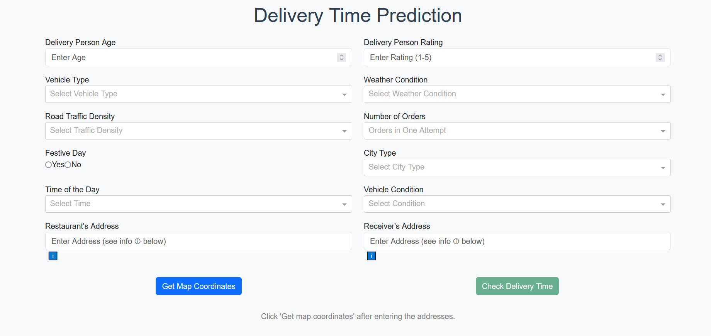
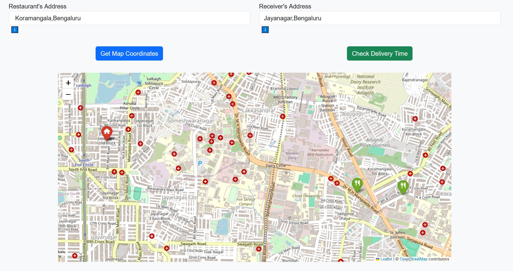

# Food Delivery Time Predictor [Application](https://huggingface.co/spaces/ashish-001/delivery-time-predictor)

This project predicts the estimated time required to deliver food to a given location based on various features. It combines advanced machine learning techniques with an interactive user interface to enhance user experience and prediction accuracy.

---
### 📸 Screenshots  
**Main Page**  
  

**Interactive Map**  
  

---

## 📋 Key Features

1. **Accurate Delivery Time Predictions**  
   - Predicts the time taken for food delivery based on historical and real-time data.  
   - Built using **XGBoost Regressor** with optimized parameters tuned using **Hyperopt**.

2. **Performance Metrics**  
   - **Test Score (R²)**: `0.8116`  
   - **Train Score (R²)**: `0.8625`  
   - **Test RMSE**: `4.016`

3. **Interactive UI**  
   - Features an interactive map built with **Folium**, allowing users to manually select their delivery location.  
   - Draggable markers for precise geolocation when the address cannot be found automatically.  

4. **Seamless User Interaction**  
   - Users can input their address, and the system geocodes the location.  
   - If the address is not found, users can drag a marker to specify their exact location.  
   - The map adjusts dynamically to show both the restaurant and delivery locations.  

5. **Technologies Used**  
   - **Machine Learning**: XGBoost Regressor  
   - **Hyperparameter Tuning**: Hyperopt  
   - **Interactive Maps**: Folium  
   - **UI Development**: Dash and Plotly  

6. **Extensibility**  
   - Modular code design allows for easy integration with additional features, such as weather data for delivery time adjustments.

---

## 🚀 Setup Instructions

1. Clone the repository:  
   ```
   git clone https://github.com/Ashish-C01/delivery-time-predictor.git
   cd delivery-time-predictor
    ```
2. Install dependencies:
    ```bash
    pip install -r requirements.txt
    ```
3. Run the application:
    ```
    python app.py
    ```
4. Access the application in your browser at:
    ```
    http://127.0.0.1:7860
    ```
## 🛠️ How It Works

1. Enter all the required details along with your address and the restaurant's address in the input fields.  
2. If the system cannot locate the address, use the **interactive map** to specify the location by dragging the markers.  
3. The system processes the data and predicts the estimated delivery time.  

---

## 📊 Project Workflow

1. **Data Preprocessing**  
   - Cleaned and prepared the dataset with relevant features.  

2. **Model Training**  
   - Used **XGBoost Regressor** for accurate delivery time predictions.  
   - Tuned hyperparameters using **Hyperopt** for optimal performance.  

3. **Model Evaluation**  
   - Evaluated the model on test data to ensure robust performance.  

4. **User Interface Development**  
   - Built a user-friendly UI with interactive map functionalities using **Dash** and **Folium**.  

---

## 🧰 Requirements

- **Python 3.10 or above**  
- Required libraries (installed via `requirements.txt`):  
  - **XGBoost**  
  - **Dash**  
  - **Folium**  
  - **Hyperopt**  
  - **Geopy**  
  - **Dash-bootstrap-components**
  - **Requests**
  - **Pandas**
  - **Jinja2**

